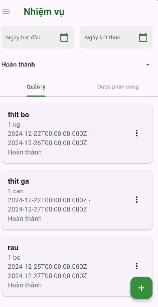
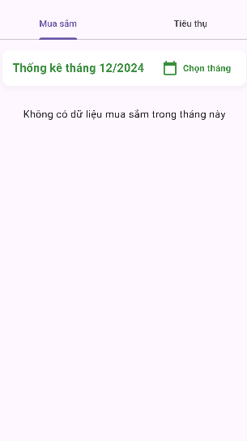
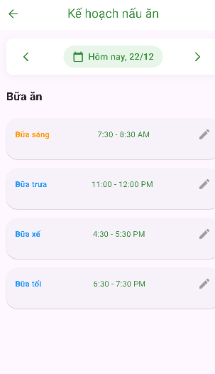
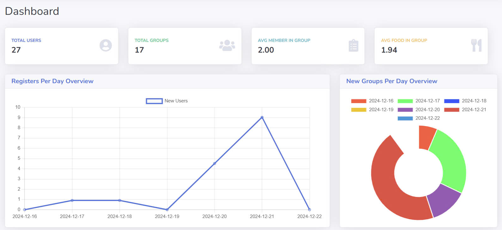

# Đi Chợ Tiện Lợi

"Đi Chợ Tiện Lợi" là một ứng dụng di động đa nền tảng được thiết kế để đáp ứng nhu cầu quản lý mua sắm, tiêu thụ thực phẩm và lập kế hoạch bữa ăn một cách thông minh và tiện lợi. Ứng dụng giúp người dùng tối ưu hóa thời gian, giảm thiểu lãng phí thực phẩm, và nâng cao chất lượng cuộc sống.

---

## 📌 Mục Tiêu Của Ứng Dụng

1. **Giảm Lãng Phí Thực Phẩm:**
    - Nhắc nhở khi thực phẩm sắp hết hạn.
    - Gợi ý cách sử dụng thực phẩm hiệu quả để tránh lãng phí.

2. **Nâng Cao Chất Lượng Cuộc Sống:**
    - Lập kế hoạch bữa ăn và đề xuất món ăn dựa trên nguyên liệu sẵn có.
    - Đảm bảo chế độ ăn uống lành mạnh và hợp lý.

3. **Tiện Ích Gia Đình:**
    - Chia sẻ danh sách mua sắm với các thành viên trong gia đình.
    - Phân công nhiệm vụ để phối hợp công việc hiệu quả hơn.

4. **Ứng Dụng Đa Nền Tảng:**
    - Sử dụng trên nhiều thiết bị (Android, iOS).
    - Quản lý danh sách và kế hoạch mua sắm mọi lúc, mọi nơi.

---

## 🛠️ Chức Năng Chính

- **Quản Lý Danh Sách Mua Sắm:**
    - Tạo, chỉnh sửa, và chia sẻ danh sách mua sắm.
    - Theo dõi trạng thái các món hàng (đã mua, cần mua).

- **Quản Lý Thực Phẩm:**
    - Ghi nhận thực phẩm hiện có trong tủ lạnh hoặc nhà bếp.
    - Cảnh báo khi thực phẩm sắp hết hạn.

- **Lập Kế Hoạch Bữa Ăn:**
    - Đề xuất thực đơn hàng ngày từ nguyên liệu sẵn có.
    - Tích hợp gợi ý công thức nấu ăn.

- **Chia Sẻ và Phân Công:**
    - Chia sẻ danh sách mua sắm với các thành viên.
    - Phân công nhiệm vụ mua sắm trong nhóm gia đình.

---

## 🌟 Lợi Ích Nổi Bật

1. **Tiết kiệm thời gian:** Giảm thiểu công sức lập danh sách và lên kế hoạch.
2. **Khoa học và hợp lý:** Quản lý thực phẩm và bữa ăn hiệu quả.
3. **Tăng tiện lợi:** Chia sẻ công việc và danh sách mua sắm trong gia đình.
4. **Bảo vệ môi trường:** Góp phần giảm lãng phí thực phẩm.

---

## 📱 Giao Diện Người Dùng

- **Danh sách mua sắm:** Quản lý danh sách chi tiết.
- **Kế hoạch bữa ăn:** Gợi ý món ăn từ nguyên liệu sẵn có.
- **Thực phẩm trong tủ lạnh:** Danh sách thực phẩm trong tủ lạnh mà bạn có.
- **Thông báo hạn sử dụng:** Nhắc nhở trực quan về thực phẩm sắp hết hạn.
- **Thông tin cá nhân:** Quản lý thông tin cá nhân của bạn.
---

## 🚀 Hướng Dẫn Cài Đặt và Sử Dụng

Dự án được chia thành ba phần chính: **Server (Node.js)**, **Admin (React.js)**, và **Frontend (Flutter)**. Dưới đây là hướng dẫn chi tiết cho từng phần.

---

### **1. Server (Node.js)**

#### **Yêu cầu:**
- Node.js phiên bản >= 14.x
- npm (hoặc yarn)

#### **Hướng dẫn:**
1. Điều hướng đến thư mục `backend`:
   ```bash
   cd backend
    ```
2. Cài đặt các dependencies:
    ```bash
    npm install
    ```
3. Chạy server với Nodemon:
    ```bash
    nodemon index.js
    ```
### **2.  Admin(React)**

#### **Yêu cầu:**
- Node.js phiên bản >= 14.x
- npm (hoặc yarn)

#### **Hướng dẫn:**
1. Điều hướng đến thư mục `admin`:
   ```bash
   cd admin
    ```
2. Cài đặt các dependencies:
    ```bash
    npm install
    ```
3. Chạy ứng dụng trên trình duyệt web:
    ```bash
    npm start
    ```
### **3. User (Flutter)**

#### **Yêu cầu:**
- Flutter SDK
- Một thiết bị giả lập (emulator) hoặc thiết bị thật kết nối qua USB.


#### **Hướng dẫn:**
1. Điều hướng đến thư mục `frontend`:
   ```bash
   cd frontend
    ```
2. Cài đặt các dependencies:
    ```bash
    flutter pub get
    ```
3. Chạy ứng dụng:
    ```bash
    flutter run
    ```
## Kết quả
Dưới đây là kết quả một phần của giao diện, chi tiết kết quả xem tại [docx](./docs).
### User




### Admin



